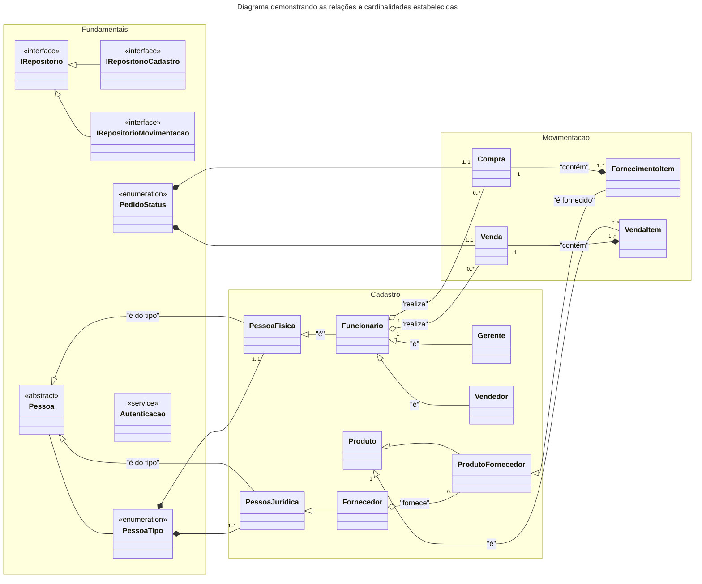
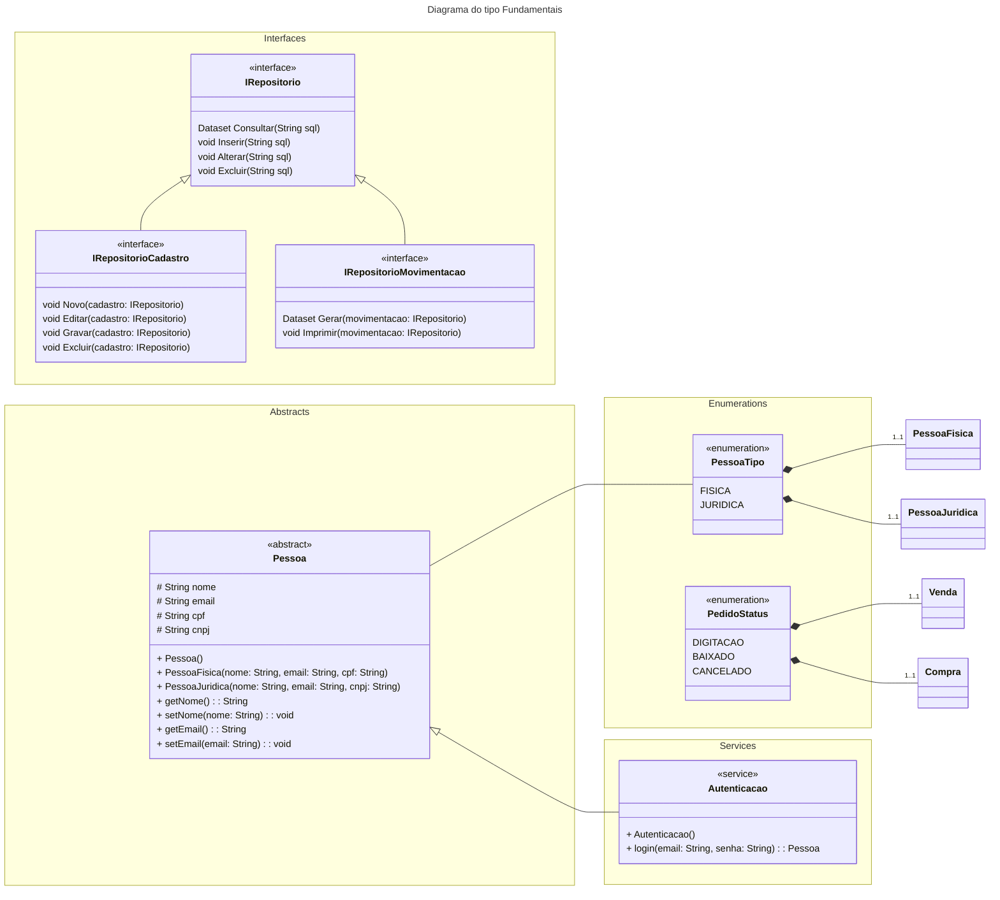
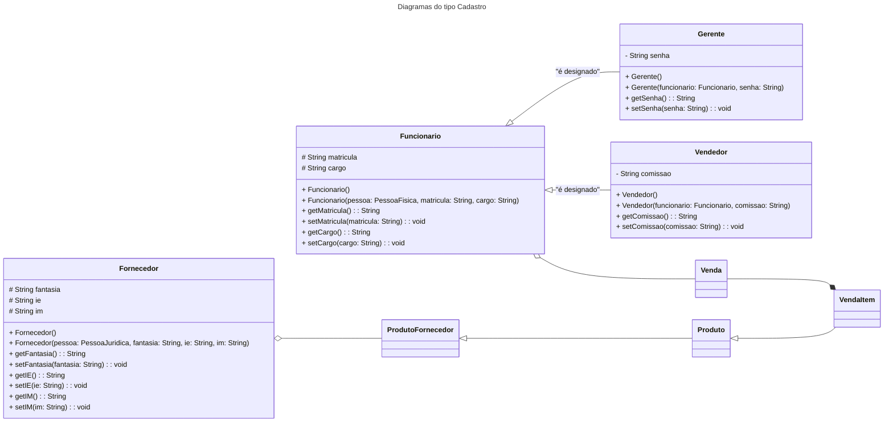
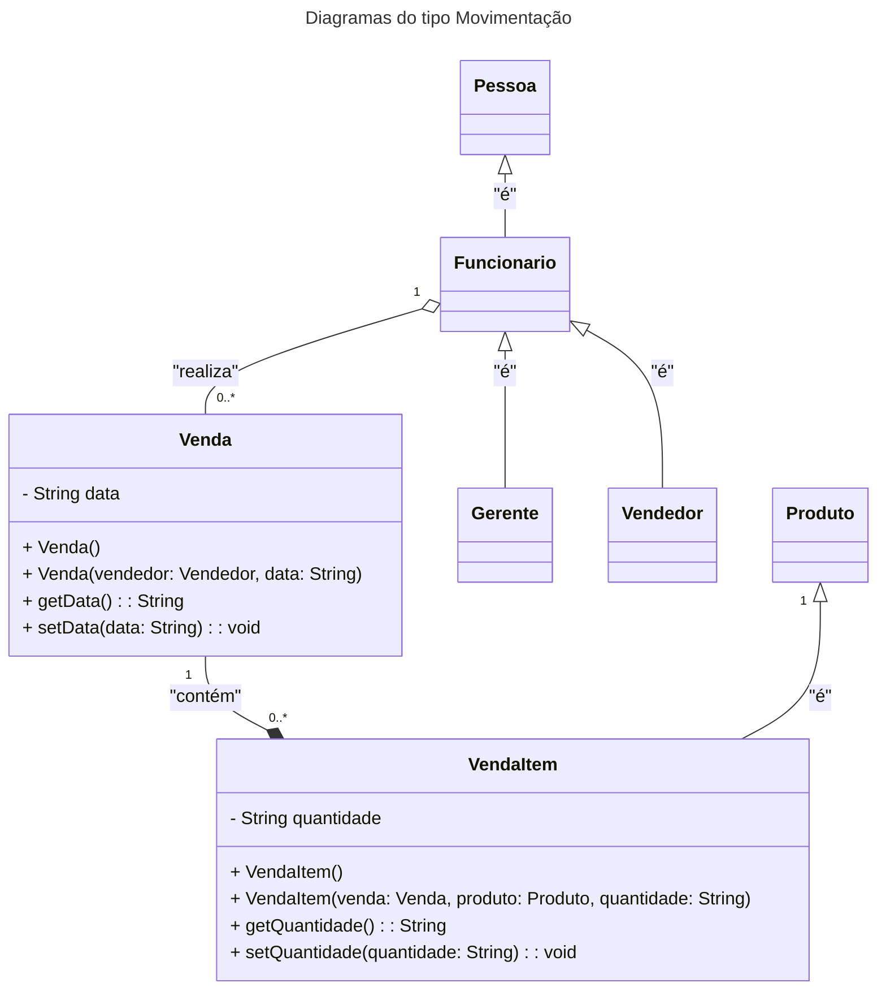

# Sistema Venda de Produtos

 ES3m230818 01 00404822222015 CL Venda de Produtos

 Repositório original: https://github.com/h4mn/fatec_engenharia/

## Introdução

### Visão Geral

O projeto tem como objetivo desenvolver um sistema para gerenciar o processo de venda de produtos, incluindo cadastro de funcionários, controle de estoque e operações de vendas.

### Requisitos Funcionais

- Gerenciamento de cadastro de funcionários, incluindo vendedores e gerentes;
- Controle de estoque de produtos e fornecimentos;
- Processamento de pedidos e vendas;
- Autenticação de usuários.

### Requisitos Técnicos

- Linguagem de programação **Python**;
- Banco de dados **SQLite**;
- Framework **Django** para a interface do usuário.

## Enunciado

Um funcionário pode ser cadastrado como vendedor ou como gerente, que não pode realizar vendas, mas lidera os vendedores (ou, futuramente, como algum outro cargo, todos exclusivos), pois possuem alguns atributos comuns, porém outros distintos.

O vendedor pode emitir muitos pedidos (vendas, cada uma, realizada por um único vendedor) ou até não realizar venda alguma. Cada venda é composta por ao menos um, ou por vários itens de produto, cada um correspondendo a um exclusivo produto. Por sua vez, cada produto (cujos itens correspondentes serão vendidos “aos montes”) pode estar cadastrado, mesmo que não haja qualquer venda de um item correspondente.

Os itens de produto podem ser fornecidos por um ou por vários fornecedores (a data em que ocorre cada um de vários fornecimentos deve ser anotada), cada qual podendo fornecer vários itens de produto ou ser cadastrado, mesmo que ainda não os tenha fornecido.

## Diagramas de Classes

### Diagrama de Visão Geral

### Diagrama de Classes Fundamentais

### Tipo Cadastro

        namespace Cadastro {
            class PessoaFisica
            class PessoaJuridica
            class Funcionario
            class Gerente
            class Vendedor
            class Fornecedor
            class Produto
            class ProdutoFornecedor
        }
        Pessoa <|-- PessoaFisica : "é do tipo"
        Pessoa <|-- PessoaJuridica : "é do tipo"
        PessoaFisica <|-- Funcionario : "é"
        Funcionario <|-- Gerente : "é"
        Funcionario <|-- Vendedor : "é"
        PessoaJuridica <|-- Fornecedor
        Fornecedor o-- "0..*" ProdutoFornecedor : "fornece"
        Produto <|-- ProdutoFornecedor

### Tipo Movimentacao

### Tipo Movimentação

