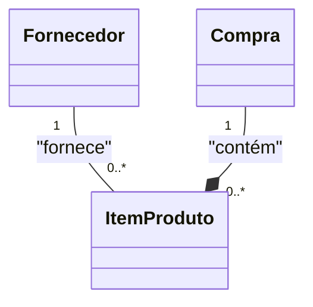

# Aula 03

 ES3m230825 03 0040482222015 Fornecedor Compra

 Repositório: https://github.com/h4mn/fatec_engenharia/

## Enunciado

### Sistema de Venda de Produtos

Anexo: [2.6. UML_CL_Exerc05_Produtos_SemAtrib.pdf](../materiais/2.6.UML_CL_Exerc05_Produtos_SemAtrib.pdf)

### Texto do enunciado

Os itens de produto podem ser fornecidos por um ou por vários fornecedores (a data em que ocorre cada um de vários fornecimentos deve ser anotada), cada qual podendo fornecer vários itens de produto ou ser cadastrado, mesmo que ainda não os tenha fornecido. 

## Exercício

### Diagramas de Compra e Fornecedor

