# Aula 04

 ES3m230825 04 0040482222015 Com Atributos

 Repositório: [github.com/h4mn/fatec_engenharia](https://github.com/h4mn/fatec_engenharia/)

## Enunciado

### Sistema de Venda de Produtos

Anexo: [2.6. UML_CL_Exerc05_Produtos_COMAtrib.pdf](../materiais/2.6.UML_CL_Exerc05_Produtos_COMAtrib.pdf)

### Texto do enunciado

Crie as classes, com os respectivos atributos, métodos e visibilidades, além das ligações entre elas, obedecendo o tipo adequado, bem como as cardinalidades.

| Classes       | Atributos               | Exemplos de conteúdos e parâmetros   | Métodos                              |
|---------------|-------------------------|-------------------------------------|--------------------------------------|
| Fornecedor    | CNPJ (PK)               | 000111222444455 (6)                 | Manter Fornecedor In: 000111222444455 (6) Out: TRUE ou FALSE |
|               | Nome                    | Tabajara Trading Group Corporation |                                      |
|               | Endereço                | Alameda da Rocinha, 444            |                                      |
|               | Cep                     | 30303-030 (não armazena-se a máscara, “-“) |                                  |
|               | Cidade                  | Rio de Janeiro                     |                                      |
|               | Estado                  | RJ                                  |                                      |
|               | Telefones               | (21) 3411-1112...                  |                                      |
| Funcionário   | Matrícula (PK)          | 0123456789(1)                       | Manter Funcionário In: 0123456789(1) Out: TRUE ou FALSE |
|               | Nome                    | Margarida Noriana Kremoza Semçal   |                                      |
|               | Endereço                | Ladeira do Sabão, 111              |                                      |
|               | Cep                     | 05050-050 (não armazena-se a máscara, “-“) |                                  |
|               | Cidade                  | Sampa                               |                                      |
|               | Estado                  | SP                                  |                                      |
| Gerente       | Matrícula (PK)          | 0123456789(1)                       |                                      |
|               | Nome                    | Pi Erre Quadrático Exponencial     |                                      |
|               | Endereço                | Praça Central, 333                 |                                      |
|               | Cep                     | 60606-606 (não armazena-se a máscara, “-“) |                                  |
|               | Cidade                  | Brasília                            |                                      |
|               | Estado                  | DF                                  |                                      |
|               | Formação                | MBA em Administração de Empresas   |                                      |
| Produto       | Código do produto (PK)  | 12345 (5)                           | Manter Produto In: 12345 (5) Out: TRUE ou FALSE |
|               | Descrição               | Processador Intel I9 – 13ª geração |                                      |
|               | Unidade                 | Un (outras unidades são: pç, dz, kg, un, l, pcte, etc.) |                           |
|               | Preço                   | $ 13.500,00(3)                     |                                      |
| Venda         | Número (PK)             | 987654321 (2)                       | Manter Venda In: 987654321 (2) Out: TRUE ou FALSE |
|               | Data da venda           | dd/mm/aaaa  do momento da venda, vinda do S.O. |                              |
|               | Valor                   | $ 1.500,00                         |                                      |
| Vendedor      | Matrícula (PK)          | 0234567890(1)                       | Realizar Pedidos In: 987654321 (2) Out: TRUE ou FALSE |
|               | Nome                    | Honnoffre Godofredo                |                                      |
|               | Endereço                | Rua das Geringonças, 222           |                                      |
|               | Cep                     | 20202-202 (não armazena-se a máscara, “-“) |                                  |
|               | Cidade                  | Santa Rita do Passa Quatro         |                                      |
|               | Estado                  | MG                                  |                                      |

## Exercício

### Diagramas com Atributos

#### Mermaid Code

```
classDiagram
    Fornecedor "1" -- "0..*" ItemProduto : "fornece"
    Compra "1" --* "1..*" ItemProduto : "contém"
```

#### Mermaid Render

```mermaid
classDiagram
namespace Pessoas {
    class Pessoa {
        - nome: String
        - endereco: String
        - cep: String
        - cidade: String
        - estado: String
        + setNome(nome: String): void
        + getNome(): String
        + setEndereco(endereco: String): void
        + getEndereco(): String
        + setCep(cep: String): void
        + getCep(): String
        + setCidade(cidade: String): void
        + getCidade(): String
        + setEstado(estado: String): void
        + getEstado(): String
    }
    class Funcionario {
        - matricula: String
        - nome: String
        - endereco: String
        - cep: String
        - cidade: String
        - estado: String
        + setMatricula(matricula: String): void
        + getMatricula(): String
        + setNome(nome: String): void
        + getNome(): String
        + setEndereco(endereco: String): void
        + getEndereco(): String
        + setCep(cep: String): void
        + getCep(): String
        + setCidade(cidade: String): void
        + getCidade(): String
        + setEstado(estado: String): void
        + getEstado(): String
        + manterFuncionario(matricula: String): Boolean
        
    }
    class Gerente {
        - matricula: String
        - nome: String
        - endereco: String
        - cep: String
        - cidade: String
        - estado: String
        - formacao: String
        + setMatricula(matricula: String): void
        + getMatricula(): String
        + setNome(nome: String): void
        + getNome(): String
        + setEndereco(endereco: String): void
        + getEndereco(): String
        + setCep(cep: String): void
        + getCep(): String
        + setCidade(cidade: String): void
        + getCidade(): String
        + setEstado(estado: String): void
        + getEstado(): String
        + setFormacao(formacao: String): void
        + getFormacao(): String
        + autorizarVenda(matricula: String, venda: String): Integer
    }
    class Vendedor {
        - matricula: String
        - nome: String
        - endereco: String
        - cep: String
        - cidade: String
        - estado: String
        + setMatricula(matricula: String): void
        + getMatricula(): String
        + setNome(nome: String): void
        + getNome(): String
        + setEndereco(endereco: String): void
        + getEndereco(): String
        + setCep(cep: String): void
        + getCep(): String
        + setCidade(cidade: String): void
        + getCidade(): String
        + setEstado(estado: String): void
        + getEstado(): String
        + realizarPedido(venda: String): Integer
    }
    class Fornecedor {
        - cnpj: String
        - nome: String
        - endereco: String
        - cep: String
        - cidade: String
        - estado: String
        - telefones: String
        + setCnpj(cnpj: String): void
        + getCnpj(): String
        + setNome(nome: String): void
        + getNome(): String
        + setEndereco(endereco: String): void
        + getEndereco(): String
        + setCep(cep: String): void
        + getCep(): String
        + setCidade(cidade: String): void
        + getCidade(): String
        + setEstado(estado: String): void
        + getEstado(): String
        + setTelefones(telefones: String): void
        + getTelefones(): String
        + manterFornecedor(cnpj: String): Boolean
    }

}
```


