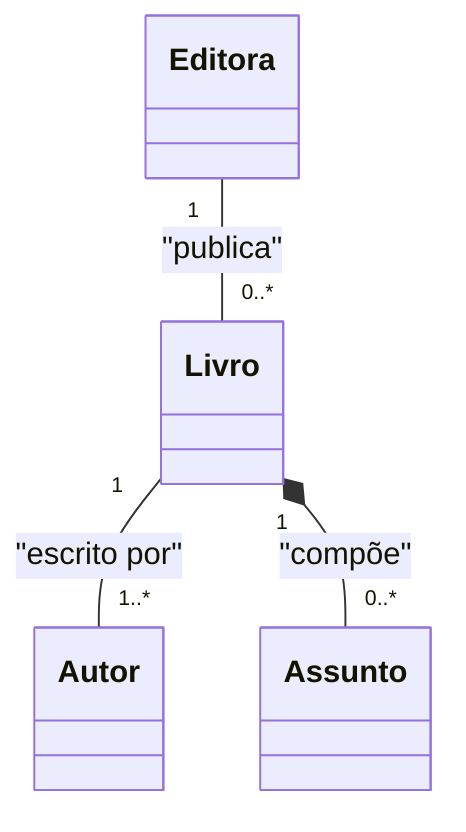

# Aula 05

> ES3m230913 05 0040482222015 CL Editora de Livros

 Repositório: [github.com/h4mn/fatec_engenharia](https://github.com/h4mn/fatec_engenharia/)

## Enunciado

### Exercício - Cadastro de Livros por Autor em Editora

Anexo: [2.9. UML_CL_Exerc09_Editora de Livros.pdf](../materiais/2.9.UML_CL_Exerc09_Editora%20de%20Livros.pdf)

### Texto do Enunciado

O sistema de uma publicadora cadastra quaisquer editoras que pretendam ou tenham editado livros. Cada livro poderá ser escrito por um ou mais autores, os quais serão cadastrados assim que escreverem seu primeiro de muitos livros, sendo que cada um está associado a um único assunto, previamente cadastrado, mesmo que ainda não haja livros a ele associados.

### Estrutura das Tabelas

| Tabela | Coluna | Tipo de Dados |
|:-------|:-------|:--------------|
| Editora | codedit | Numérico inteiro com valor máximo inferior a 100 |
| | nome | Cadeia de caracteres de tamanho variável, com tamanho máximo igual a 80 caracteres |
| Assunto | sigla | Cadeia de caracteres de tamanho fixo igual a 1 caractere |
| | descricao | Cadeia de caracteres de tamanho variável, com tamanho máximo igual a 50 caracteres |
| Autor | matricula | Numérico inteiro com valor máximo inferior a 1000 |
| | nome | Cadeia de caracteres de tamanho variável, com tamanho máximo igual a 80 caracteres |
| | cpf | Cadeia de caracteres de tamanho fixo igual a 11 caractere |
| | endereco | Cadeia de caracteres de tamanho variável, com tamanho máximo igual a 12 caracteres (depois será alterado para mais caracteres) |
| | nascim | Data |
| | pais | Cadeia de caracteres de tamanho fixo, com tamanho máximo igual a 2 caracteres (sigla do País) |
| Livro | codlivro | Numérico inteiro com valor máximo inferior a 1000 |
| | titulo | Cadeia de caracteres de tamanho variável, com tamanho máximo igual a 80 caracteres |
| | preco | Número real |
| | lancamento | Data |

## Exercício

### Diagrama

#### Relacionamentos

```txt
classDiagram
    Editora "1" -- "0..*" Livro : "publica"
    Livro "1" -- "1..*" Autor : "escrito por"
    Livro "1" *-- "0..*" Assunto : "compõe"
```



#### Atributos

```txt
classDiagram
    direction LR
    class FakeNum {
        <<domain>>
        %%"valida se o número é menor que 100"
        DezenaInt(Char[2] numero) : int
        %%"valida se o número é menor que 1000"
        CentenaInt(Char[3] numero) : int
    }
    class Editora{
        +DezenaInt[99] codedit
        +Char[80] nome
    }
    class Assunto{
        +Char[1] sigla
        +Char[50] descricao
    }
    class Autor{
        +CentenaInt[999] matricula
        +Char[80] nome
        +Char[11] cpf
        +Char[12] endereco
        +Date nascim
        +Char[2] pais
    }
    class Livro{
        +CentenaInt[999] codlivro
        +Char[80] titulo
        +Real preco
        +Date lancamento
    }
```

[](https://mermaid.live/edit#pako:eNqVk89qAjEQxl9lCAgt9aAthbqIULSFgvRgj-phSMYa3CTb_BFa8YH6Cr36Yp3VVlddCs1pmcz38ZsvsyshnSKRCZljCAONrx7NxAIfpT3JqJ2F4WhX2fbAIy7oORlY7Yrl6XaVM6htr3eoNRoTscRcK4RA4MBuvgx5B5tPMGSdh7dE0G61JuKgGdAHWXyy8aI_Rz--noJNpegSMtA2_t_8yL1PNlbtb2rt19VZH5SOzmNl1Ks947jTmUKZHvdU7rfWdy32doZqLO9DSDa61amkPYWgX3M8rd-ylaIgvZbo6vwSEx657cdkQkY0GFmbzp2PISskjCKL2VmZn4OsIt4KV80DI4HFILU5VbCgQB1qoId66d1f0JxrXvbUMUcdU169GRHmUNRx5Wgl8kbE3-REU_CL864q3vktwETEOXEIIuNPhX5RrkzZhxzsy7uVIos-UVOkQrHlzy8ishnmgdbfUZH7vA)
