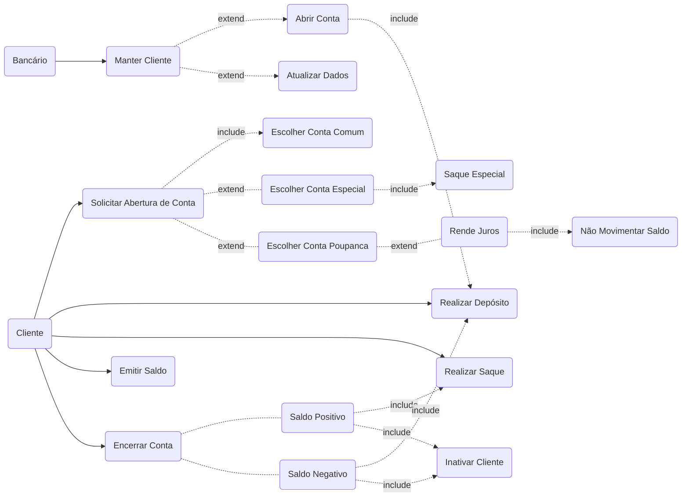

# Aula 06

> ES3m230920 06 0040482222015 UC Conta Bancária

 Repositório: [github.com/h4mn/fatec_engenharia](https://github.com/h4mn/fatec_engenharia/)

## Enunciado

### Exercício - Cadastro de Livros por Autor em Editora

Anexo: [2.9. UML_CL_Exerc09_Editora de Livros.pdf](../materiais/01.4.%20UML_UC_Exerc05_ContaBanco.pdf)

### Texto do Enunciado

#### Conta bancária

Um cliente solicita a abertura de uma conta, a qual pode ser uma conta comum, que não permite a retirada de mais dinheiro do que está depositado, uma conta especial, que permite o saque extra até um determinado limite, ou uma conta-poupança, que rende juros enquanto o dinheiro depositado permanecer sem ser movimentado.

Como os processos de abertura para cada tipo de conta têm características muito semelhantes entre si, com poucas distinções, pode-se (é bom) colocar o caso de uso Abrir Conta Comum como uma generalização (embora ele seja efetivamente utilizado) e os outros dois tipos de abertura como especializações do primeiro, detalhando-se em sua documentação as características particulares que elas têm em relação ao caso de uso geral Abrir Conta Comum. Uma alternativa seria definir um caso de uso geral, denominado simplesmente Abrir Conta, que não seria utilizado diretamente, e derivar a partir daí os três tipos de abertura de conta possíveis.

No momento em que um funcionário executa o processo de manutenção do cadastro de clientes (Manter Clientes), uma conta comum pode ser aberta. Embora o caso de uso Manter Clientes possa ser utilizado independentemente pelos funcionários do banco, a criação de uma conta bancária normalmente implica o registro do novo cliente ou, se este já estiver cadastrado, uma possível atualização. No entanto, como nem sempre é necessário registrar ou atualizar o cliente, esse caso de uso não constitui uma ação obrigatória, pois só será utilizado se o cliente que deseja abrir a conta não estiver registrado ou precisar atualizar seus dados.

É obrigatório depositar algum valor no momento em que o processo de abertura da conta for concluído. Assim, sempre que uma conta for aberta, as instruções contidas no caso de uso Realizar Depósito serão igualmente executadas.

Um cliente pode eventualmente querer encerrar uma conta, porém, antes de fazê-lo, algumas operações devem ser executadas. Em primeiro lugar, é preciso verificar o saldo da conta (Emitir Saldo) para determinar se o banco precisa devolver algum dinheiro ao cliente ou, caso a conta seja especial e estiver negativa, se o cliente precisa depositar algum dinheiro para encerrar a conta. Se o saldo estiver positivo, deve-se realizar um saque por meio do caso de uso Realizar Saque. Se o saldo estiver negativo, deve-se realizar um depósito por intermédio do caso de uso Realizar Depósito. Como não é possível saber se vai ser necessário ou não sacar ou depositar algum valor, as associações entre os casos de uso Encerrar Conta, Realizar Saque e Realizar Depósito são efetuadas opcionalmente. No caso de encerramento de conta, se o cliente possuía apenas esta conta, deve-se Manter o Cliente, tornando-o inativo, pois, uma vez cliente, seu registro não pode ser excluído do sistema, o mesmo ocorrendo com quaisquer contas que um dia ele possa ter tido na instituição bancária. Esta pode ser definida como encerrada, mas jamais excluída.

Existem ainda os casos de uso Emitir Saldo e Emitir Extrato, que são serviços que podem ser utilizados diretamente pelo cliente por meio de um caixa eletrônico, sem a intermediação de um funcionário. Como são serviços simples, não necessitam de interações com outros casos de uso do diagrama, embora o caso de uso Emitir Saldo seja utilizado pelo caso de uso Encerrar Conta, conforme já descrito.

Finalmente, há os casos de uso Realizar Saque e Realizar Depósito, que já foram citados, por poderem ser também requisitados pelo caso de uso Encerrar Conta. Normalmente, no entanto, tais serviços, da mesma maneira que os casos de uso Saldo e Extrato, serão utilizados diretamente pelo cliente. Contudo, esses serviços necessitam registrar o movimento realizado, razão pela qual ambos obrigatoriamente utilizam o caso de uso Registrar Movimento, que, para fins de histórico bancário, registra qualquer saque ou depósito porventura realizado em uma conta.

### Exercício

#### Diagrama

