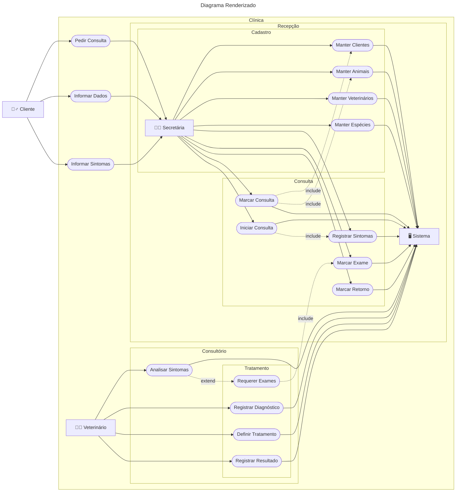

# Aula 07

> ES3m230927 07 0040482222015 UC Clínica Veterinária

 Repositório: [github.com/h4mn/fatec_engenharia](https://github.com/h4mn/fatec_engenharia/)

## Enunciado

### Texto do Enunciado

#### Clínica Veterinária

Os clientes primeiramente marcam consultas com a secretária, fornecendo suas informações pessoais e as dos animais que desejam tratar. Se o cliente ou o animal ainda não estiver cadastrado no sistema ou existir algum dado que precise ser atualizado, a secretária deverá atualizar o cadastro.

Em cada sessão de tratamento (uma sessão equivale a uma consulta), o cliente deve informar os sintomas aparentes do animal, os quais devem ser registrados. Um tratamento pode ser encerrado em apenas uma consulta, quando se tratar de algo simples, ou pode arrastar-se por muitas sessões, dependendo do diagnóstico do médico-veterinário.

Durante uma consulta, o veterinário pode marcar exames para o animal, a serem trazidos na sessão seguinte. O pedido dos exames e seus resultados devem ser registrados no histórico de tratamentos do animal. Após cada sessão, o histórico da consulta deve ser atualizado.

É responsabilidade da secretária manter atualizados os cadastros de clientes, animais, médicos e espécies.

Os atores que compõem esse diagrama são descritos a seguir:

- **Cliente** - este Ator representa uma pessoa física que possua um ou mais animais que alguma vez foram tratados pela clínica.
- **Secretária** – a descrição deste ator é autoexplicativa. Ele representa os funcionários da clínica responsáveis por marcar consultas e manter a maioria dos cadastros da empresa.
- **Veterinário** - este ator também é autoexplicativo, representando os médicos-veterinários da clínica que atendem os animais.

Os casos de uso que compõem o sistema são os seguintes:

- **Marcar Consulta** - este caso de uso representa as etapas necessárias para que um cliente possa agendar uma consulta para um determinado animal. Nesse caso de uso interagem os atores Cliente e Secretária. Observe que, a partir desse caso de uso, podem ser executados os casos de uso Manter Clientes e Manter Animais, devido à possibilidade de que seja necessário registrar um novo cliente ou animal ou de que seus dados precisem ser atualizados. Observe que o ator Secretária pode utilizar esses dois últimos casos de uso, independentemente do caso de uso Marcar Consulta, como é possível verificar por meio da associação direta entre o ator Secretária e esses casos de uso.
- **Manter Veterinários** e **Manter Espécies** - estes dois casos de uso são bastante simples, representando os módulos de cadastro dos veterinários que trabalham na clínica, bem como as espécies de animais que são tratados na veterinária.
- **Realizar Consulta** - este caso de uso representa a documentação da consulta propriamente dita, iniciando a ser preenchida logo no início da consulta e sendo finalizada ao término da mesma pelo médico-veterinário responsável. Observe que inserimos um relacionamento de extensão com o caso de uso Marcar Exames, já que eventualmente o veterinário pode pedir ao cliente para realizar exames no animal em questão. Na verdade, a documentação desse último caso de uso poderia estar no próprio caso de uso Realizar Consulta. Pode-se preferir, no entanto, representá-lo de forma separada para tornar mais clara a compreensão do diagrama. Obviamente, os resultados dos exames seriam verificados e registrados na consulta seguinte.

### Exercício

#### Diagrama

```text
---
title: "Código Mermaid"
author: "Hadston Nunes"
date: 2023-10-01
---
graph LR
    A["🙍‍♂️ Cliente"] --> AA([Pedir Consulta])
    A --> AB([Informar Dados])
    A --> AC([Informar Sintomas])
    subgraph "Clínica"
        AA --> B["👩‍💻 Secretária"]
        AB --> B
        AC --> B
        subgraph "Recepção"
            subgraph "Cadastro"
                B --> BAA([Manter Clientes])
                B --> BAB([Manter Animais])
                B --> BAC([Manter Veterinários])
                B --> BAD([Manter Espécies])
            end

            subgraph "Consulta"
                B --> BBA([Marcar Consulta])
                B --> BBB([Iniciar Consulta])
                B --> BBC([Registrar Sintomas])
                B --> BBD([Marcar Exame])
                B --> BBE([Marcar Retorno])
                BBB -.-> |include| BBC
            end

            BBA -.-> |include| BAA
            BBA -.-> |include| BAB

            BAA --> S["🖥️ Sistema"]
            BAB --> S
            BAC --> S
            BAD --> S
            BBA --> S
            BBB --> S
            BBC --> S
            BBD --> S
            BBE --> S
        end


        D["👨‍⚕️ Veterinário"] --> DA([Analisar Sintomas])
        D --> DB([Registrar Diagnóstico])
        D --> DD([Definir Tratamento])
        D --> DE([Registrar Resultado])
        subgraph "Consultório"
            DA --> S
            DA -.-> |extend| DC([Requerer Exames])
            subgraph "Tratamento"
                DC -.-> |include| BBD
                DB --> S
                DD --> S
                DE --> S
            end
        end
    end
```



## Referências

- [01.5. UML_UC_Exerc04_Veterinaria.pdf](../materiais/01.5. UML_UC_Exerc04_Veterinaria.pdf)
- [Documentação Mermaid](http://mermaid.js.org/syntax/flowchart.html)
- [Documentação Unicode](https://emojipedia.org/)
