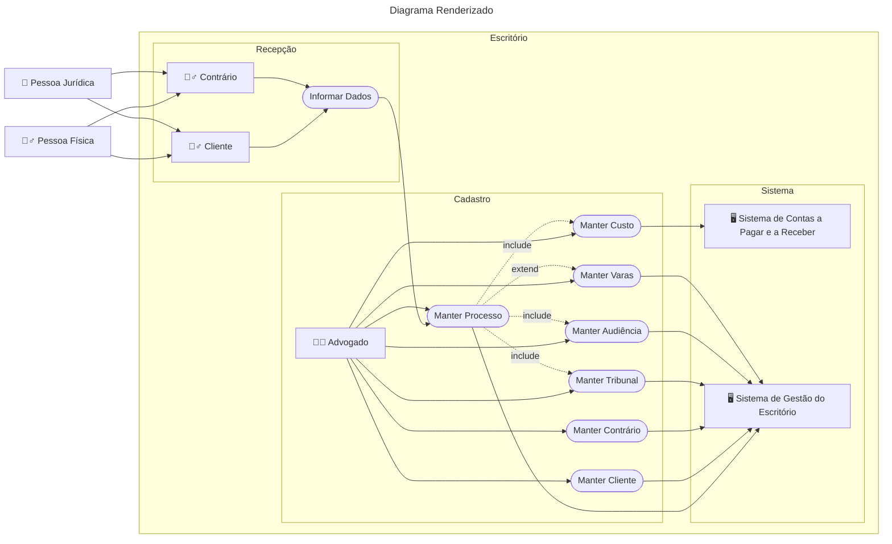

# Avaliação 01

> ES3m231004 Av1 0040482222015 UC Advocacia

 Repositório: [github.com/h4mn/fatec_engenharia](https://github.com/h4mn/fatec_engenharia/)

## Enunciado

### Texto do Enunciado

Um advogado, ao defender as causas de seus clientes, sejam eles pessoas físicas ou jurídicas, precisa manter os cadastros, tanto de seus clientes, quanto das partes contrárias (que também podem ser pessoas físicas ou jurídicas), de processos, de tribunais, e até das varas destes tribunais, caso necessário. Os clientes e contrários não têm acesso ao sistema, mas informam-lhe seus dados.

Ao se manter o processo, se os envolvidos ainda não tiverem sido anteriormente cadastrados, terão que ser, ou podem ser atualizados, caso já estejam no cadastro e haja necessidade de alguma alteração. Além disto, mantendo-se o processo, pode-se tornar necessário manter os tribunais, as audiências e as custas do processo, cujas custas serão enviadas ao Sistema de Contas a Pagar e a Receber.

## Diagrama

```text
---
title: "Código Mermaid"
author: "Hadston Nunes"
date: 2023-10-05
---
graph LR
    PessoaFisica["🙍‍♂️ Pessoa Física"] --> A1["🙍‍♂️ Cliente"]
    PessoaFisica --> A2["🙍‍♂️ Contrário"]
    PessoaJuridica["🏢 Pessoa Jurídica"] --> A1
    PessoaJuridica --> A2

    B["👨‍⚖️ Advogado"] --> BA([Manter Custo])
    subgraph "Escritório"
        subgraph "Recepção"
            A1["🙍‍♂️ Cliente"] --> AA([Informar Dados])
            A2["🙍‍♂️ Contrário"] --> AA([Informar Dados])
        end

        AA([Informar Dados]) --> BB

        subgraph "Cadastro"
            B --> BB([Manter Processo])
            B --> BC([Manter Cliente])
            B --> BD([Manter Contrário])
            B --> BE([Manter Tribunal])
            B --> BF([Manter Audiência])
            B --> BG([Manter Varas])

            BB -.-> |include| BA
            BB -.-> |include| BE
            BB -.-> |include| BF
            BB -.-> |extend| BG
        end

        subgraph "Sistema"
            BA([Manter Custo]) --> C1["🖥️ Sistema de Contas a Pagar e a Receber"]
            BB --> C2["🖥️ Sistema de Gestão do Escritório"]
            BC --> C2
            BD --> C2
            BE --> C2
            BF --> C2
            BG --> C2
        end
    end
```


