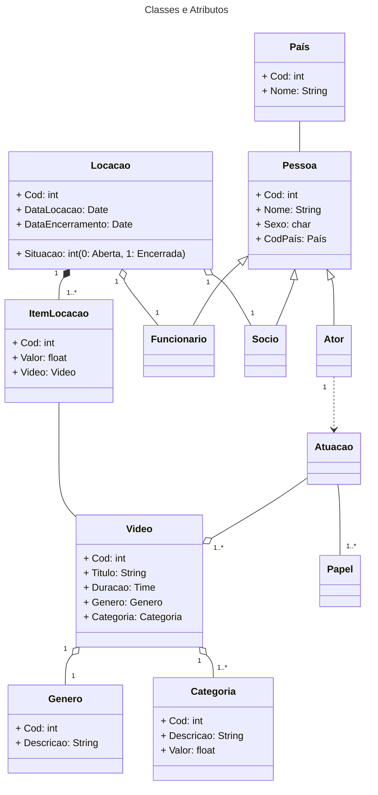
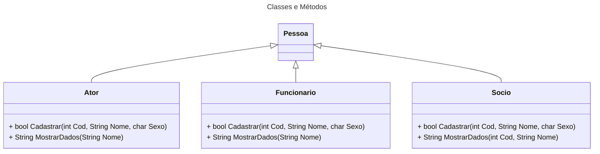

# Avaliação 01b

> ES3m231004 Av1b 0040482222015 CL Video Locadora

 Repositório: [github.com/h4mn/fatec_engenharia](https://github.com/h4mn/fatec_engenharia/)

## Enunciado

### Texto do Enunciado

#### Sistema de Videolocadora Online

Cada sócio será cadastrado, sem a exigência de locação, e pode realizar várias locações de vídeos online, cada locação ligada a um único sócio. Cada locação é composta por um ou vários exclusivos itens de locação, cada um correspondendo a um vídeo específico.

Um vídeo pode ser um documentário, sem atores, ou ter até vários atores, cada qual podendo atuar em vários vídeos e, em cada atuação, podendo assumir mais que 1 papel. Cada vídeo possui um único gênero, o qual pode ser cadastrado mesmo que não haja um vídeo ao qual se associar, sendo que o mesmo ocorre com a categoria.

Há um funcionário humano, cuja função é a de resolver falhas que porventura ocorram na locação.

Detalhamento de cada classe:

| Classes | Atributos, Tipos e Métodos |
| :-----: | :------------------------- |
| Ator | Identificador do ator (inteiro), nome (literal longo), sexo (literal curto) e código de seu País (o mesmo de DDI), todos públicos. Métodos: Cadastrar, com parâmetros de entrada identificador do ator, nome e sexo, e saída booleana, e Mostrar Dados, com parâmetros nome e saída literal longa. |
| Funcionário | Código do funcionário (literal longo); sexo (literal curto), nome, endereço, telefone, email, literais longos, e código de seu País (o mesmo de DDI), todos públicos. Métodos: Cadastrar, com parâmetros de entrada código do funcionário, nome, sexo, e saída booleana, e Mostrar Dados, com parâmetros nome e saída literal longa. |
| Sócio | Código do sócio (inteiro), sexo (literal curto), nome, endereço, telefone e email, todos literais longos, e código de seu País (o mesmo DDI), todos públicos. Métodos: Cadastrar, com parâmetros de entrada código do sócio, nome, sexo, e saída booleana, e Mostrar Dados, com parâmetros o código do sócio e nome, e saída literal longo. |
| País | Código do País, nome do País, todos públicos. |
| Categoria | Código da categoria, descrição (literal longo) e valor (ponto flutuante simples), todos públicos. |
| Vídeo | Identificador do vídeo, título (literal longo) e duração do vídeo (hora), ambos públicos. |
| Gênero | Descrição, literal longo e público. |
| Item de locação | Número do item, inteiro pequeno, e valor para locação deste item, públicos, ponto flutuante com dupla precisão. |
| Locação | Identificador da locação, data de locação e data de encerramento da locação, públicos e derivados do S.O., e situação da locação, também público (inteiro, com valor inicial = 0, e quando encerrada, o valor passa para 1). |

## Diagrama

