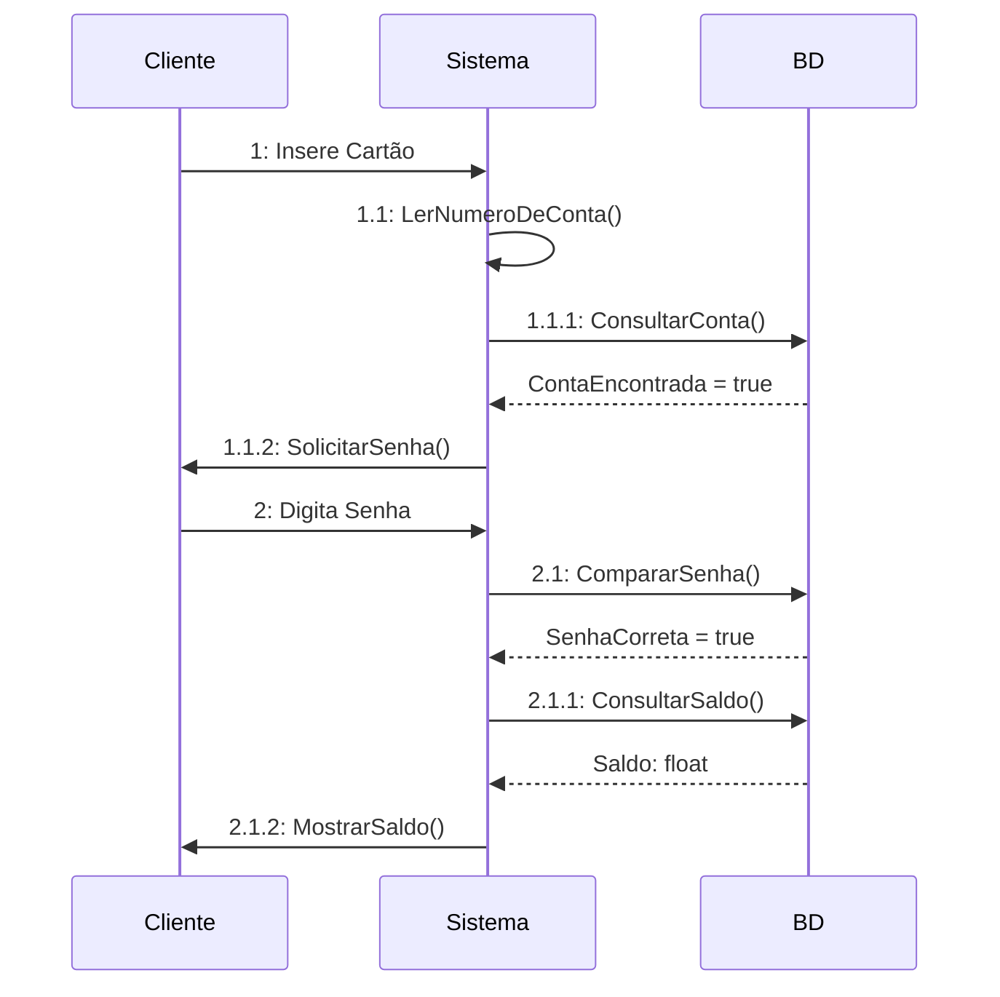

# Aula 08

> ES3m231011 08 0040482222015 DS Emitir Saldo

 Repositório: [github.com/h4mn/fatec_engenharia](https://github.com/h4mn/fatec_engenharia/)

## Enunciado

### Texto do Enunciado

#### Diagrama de Sequência - Emitir Saldo

Implemente o diagrama de sequência para o caso de uso Emitir Saldo, referente ao processo de emissão de saldo de conta bancária, sabendo que:

Pressupondo que o cliente já escolheu a opção de emissão de saldo, o cliente deve inserir o cartão bancária no leitor de cartões. O sistema lê o número de conta no cartão e verifica sua existência na base de dados. Tendo recebido a resposta positiva, o sistema solicita que o cliente digite sua senha.

Após o cliente digitar sua senhas, o sistema a validará, consultado sua equivalência no banco de dados. Assim que o sistema recebe a validação desta senha, consulta o saldo na base de dados e o demonstra no monitor de video.

Para efeito de aprendizagem inicial, este processo considerará aque o cartão está íntegro e a conta corrente e senha procuradas são compatíveis com as do banco de dados.

1. O cliente insere o cartão de conta;
2. O sistema lê o número de conta no cartão;
3. Com este número, o sistema deve consultar a existência da conta comum na base de dados (na tabela conta comum) e devolver uma variável, indicanto tê-la encontrado (tru);
4. Já que a conta existe, o sistema solicita que o cliente digite sua senha;
5. O cliente digita sua senha, que é passada à frente para a pesquisa no BD;
6. O sistema deve validar a senha, com o valor digitado e devolver uma variável que confirme estar correta;
7. Com a senha correta, o sistema consulta o saldo no banco de dados (na tabela Conta Comum) e o demonstra no monitor de video.

## Diagrama

